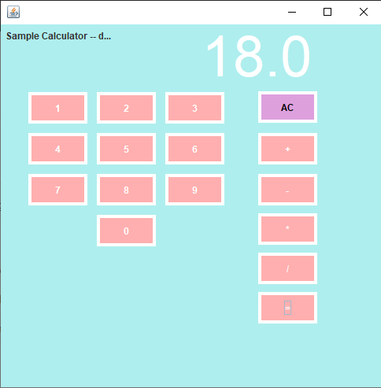
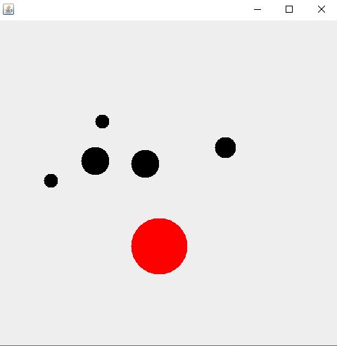
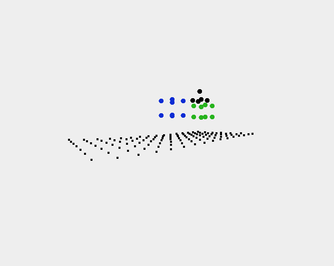

# java-portfolio

## Usage
Prerequisites:
- Java JDK 15
- Intellij IDE

The whole portfolio can be launched by running main method within Main.java

## Contributers
| GitHub Username | Person |
| --- | --- |
| @nathanielCherian | Nathaniel Cherian |
| @tonyhieu | Anthony Vo |
| @JettKim | Jett Kim |

## Aimboost
The aimboost game features random circles that spawn randomly and must be clicked with speed to be popped before they disappear.

## Calculator 
Standard Calculator with extra functions

## Run Game
A game that features action listeners and advanced game timers to allow a user to move around the map with WSAD and shoot with SPACE. There are enemies that chase and try to attack you.

## 3D World
The basics of a 3D game engine built in vanilla java making use of abstract classes and interfaces. When you spawn into the world you will see a grid and a cube floating above it. You can move around with WSAD and can move up with SPACE and down with SHIFT.
You can also use the arrow keys to change your field of view (looking left/right/up/down) although this feature is a little bugged as if right now. The project as a whole relies on alot of math to project the 3D points into a 2D plane.

## Hangman Game
A version of hangman that you can play by yourself. Type a letter into the text field, check your letter, and see if you can guess the word!

## To be completed...

- [x] Learn JPanel with Aimboost game
- [x] Learn about ation listners and timers with Run Game
- [x] Create the Math/control for the 3D game engine
- [x] Create projection algorithm for world
- [x] Allow full user mobility with swivel
- [ ] Connect lines between points
- [x] Hangman game Control/GUI

## Group Grading
### Goals for the week: 
| Person(s) | Goals |
| --- | --- |
| Nathan | Further progress on 3D World project: The 3DWorld project will make use of MVC through the many different components of the game. The process of of projecting a 3D model onto a 2D space is one that works very well with MVC. Our Model is a systen of classes that each inherit/implement their basic components. To assisst with this we created a new "primative" called Point3D. Our Control is contained within the "Camera" class, which the player controls. This calculates the projects from our 3D world to a 2D plane. | Our View is summed up with a custom GPoint class that allows us to display these points easily to the user.
| Anthony | Create basis for hangman game; use view to show letter selection, control to take in letters, model to connect the two |
| Jett, Brendan, Benny | Properly display MVC with a tic-tac-toe game; view to select box, control for finding winner, model to connect the two |
### Completion of goals:
| Person | Work | Grade |
| --- | --- | --- |
| Nathan | Completed work on 3D World, made improvements | 25/25 |
| Anthony | Finished Hangman project | 25/25 |
| Jett | Created UI for Tic-Tac-Toe game | 25/25 |
| Benny | Worked on journal for the week, but didn't code | 23/25 |
| Brendan | Worked on journal for the week, but didn't code | 23/25 |
