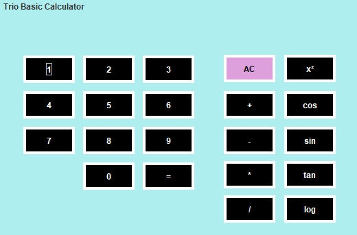
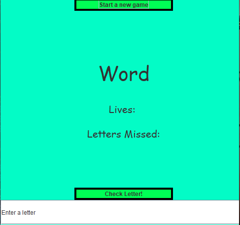
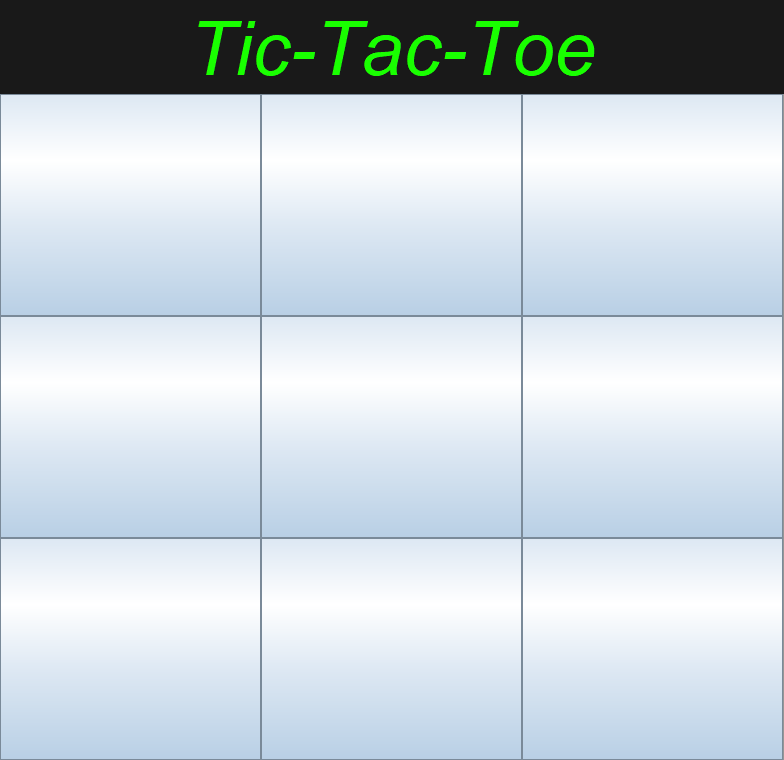

# java-portfolio

## Usage
Prerequisites:
- Java JDK 15
- Intellij IDE

The whole portfolio can be launched by running main method within Main.java.

## Contributers
| GitHub Username | Person |
| --- | --- |
| [@nathanielCherian](https://github.com/nathanielCherian) | Nathaniel Cherian |
| [@tonyhieu](https://github.com/tonyhieu) | Anthony Vo |
| [@JettKim](https://github.com/JettKim) | Jett Kim |
| [@bennyherrick](https://github.com/bennyherrick) | Benjamin Herrick |
| [@brendan8503](https://github.com/brendan8503) | Brendan Trinh |

## Final Video Presentation
[Click here to see our video](https://www.youtube.com/watch?v=CBv8huXO9hE&feature=youtu.be)

## Group Grading
### Completion of goals:
| Person | Work | Grade |
| --- | --- | --- |
| Nathan | Completed work on [3D World](https://github.com/nathanielCherian/java-portfolio/tree/master/src/world), [Aimboost](https://github.com/nathanielCherian/java-portfolio/tree/master/src/app), [Run Game](https://github.com/nathanielCherian/java-portfolio/tree/master/src/game) and [main menu](https://github.com/nathanielCherian/java-portfolio/blob/master/src/Portfolio.java). My (Anthony) pick for MVP, as he set up the integration and created the most impressive project. | 25/25 |
| Anthony | Finished [Hangman Game](https://github.com/nathanielCherian/java-portfolio/tree/master/src/hangman) and [Roulette Game](https://github.com/nathanielCherian/java-portfolio/tree/master/src/roulette). | 25/25 |
| Jett | Created UI for [Tic-Tac-Toe game](https://github.com/nathanielCherian/java-portfolio/tree/master/out/production/java-portfolio/TicTacToeGame) and added his [Calculator](https://github.com/nathanielCherian/java-portfolio/tree/master/out/production/java-portfolio/calc) project. Also completed [Snake Game](https://github.com/nathanielCherian/java-portfolio/tree/master/src/SnakeGame). | 25/25 |
| Benny | Worked on logic and control for [Tic-Tac-Toe game](https://github.com/nathanielCherian/java-portfolio/tree/master/out/production/java-portfolio/TicTacToeGame). | 25/25 |
| Brendan | Worked on logic and control for [Tic-Tac-Toe game](https://github.com/nathanielCherian/java-portfolio/tree/master/out/production/java-portfolio/TicTacToeGame). | 25/25 |

## Key Concepts
### MVC (Model View Control)
Our group used the principles of MVC in almost every lab we did. Each project is seperated into its own folder where the Model, View, and Control are separated into different files. We also used MVC to integrate our project into the main menu, as each project has its own class file that is called from Portfolio.java.

### Organization
As touched on in the last section, our project is neatly organized into a file hierarchy. Each project has its own folder and it all links together in Portfolio.java. The use of the Portfolio.java file allowed us to integrate easily and effectively. 

### Collaboration
Each member of our group was able to commit to GitHub and add to the portfolio, as seen in the commit history. We were also able to push our project onto the N@TM webpage successfully.

### Algorithms
Our projects were based on the lessons given throughout the weeks. For example, the Roulette Game uses [Stacks and ArrayLists](https://github.com/nathanielCherian/java-portfolio/blob/f49f8796fab9cd10f907946236e6603375747e73/src/roulette/RouletteUI.java#L16) in order to draw circles and fire bullets. Similarly, the [3D World](https://github.com/nathanielCherian/java-portfolio/tree/master/src/world) incorporates various algorithms to draw each of the shapes with the right field of view.

### Creativity
The use of the repaint() function in order to create 3D World and the changing color of the background in Portfolio.java deserve recognition for creativity. The variety of games showcased here also show creativity.

## Projects
### Aimboost
The aimboost game features random circles that spawn randomly and must be clicked with speed to be popped before they disappear.

### Calculator 
Standard Calculator with extra functions

### Run Game
A game that features action listeners and advanced game timers to allow a user to move around the map with WSAD and shoot with SPACE. There are enemies that chase and try to attack you.

### 3D World
The basics of a 3D game engine built in vanilla java making use of abstract classes and interfaces. When you spawn into the world you will see a grid and a cube floating above it. You can move around with WSAD and can move up with SPACE and down with SHIFT.
You can also use the arrow keys to change your field of view (looking left/right/up/down) although this feature is a little bugged as if right now. The project as a whole relies on alot of math to project the 3D points into a 2D plane.

### Hangman Game
A version of hangman that you can play by yourself. Type a letter into the text field, check your letter, and see if you can guess the word!

### Tic-Tac-Toe Game
A recreation of Tic-Tac-Toe in JFrame. (Not working, only has a UI but no control code)

### Snake Game
Our take on the classic Snake Game. Use WASD to move and eat the apples!

### Russian Roulette
A game based on Russian Roulette. Click the fire button (right below the chamber, might have to hover over it for it to appear) and see where the real bullet is.

## To be completed...

- [x] Learn JPanel with Aimboost game
- [x] Learn about ation listners and timers with Run Game
- [x] Create the Math/control for the 3D game engine
- [x] Create projection algorithm for world
- [x] Allow full user mobility with swivel
- [x] Connect lines between points
- [x] Hangman game Control/GUI
- [x] Complete Tic-Tac-Toe Game
- [x] Complete Hangman Game
- [x] Complete Snake Game
- [x] Finish foundation for Roulette Game
- [ ] Fix Reset Chamber button in Roulette Game
